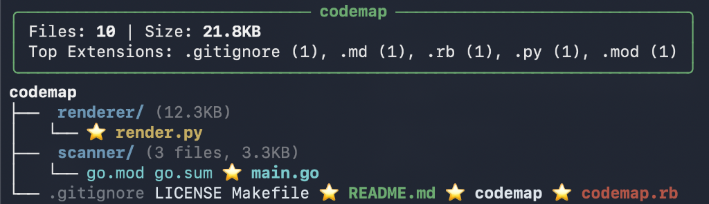

# codemap 🗺️

> **codemap — a project brain for your AI.**
> Give LLMs instant architectural context without burning tokens.




## Why codemap exists

Modern LLMs are powerful, but blind. They can write code — but only after you ask them to burn tokens searching or manually explain your entire project structure.

That means:
*   🔥 **Burning thousands of tokens**
*   🔁 **Repeating context**
*   📋 **Pasting directory trees**
*   ❓ **Answering “where is X defined?”**

**codemap fixes that.**

One command → a compact, structured “brain map” of your codebase that LLMs can instantly understand.

## Features

- 🧠 **Brain Map Output**: Visualizes your codebase structure in a single, pasteable block.
- 📉 **Token Efficient**: Clusters files and simplifies names to save vertical space.
- ⭐️ **Smart Highlighting**: Automatically flags the top 5 largest source code files.
- 📂 **Smart Flattening**: Merges empty intermediate directories (e.g., `src/main/java`).
- 🎨 **Rich Context**: Color-coded by language for easy scanning.
- 🚫 **Noise Reduction**: Automatically ignores `.git`, `node_modules`, and assets (images, binaries).

## ⚙️ How It Works

**codemap** is built for speed and structure:
1.  **Scanner (Go)**: Instantly traverses your directory, respecting `.gitignore` and ignoring junk files.
2.  **Renderer (Python)**: Consumes the raw data and renders a highly structured, color-coded ASCII tree.
3.  **Output**: A clean, dense "brain map" that is both human-readable and machine-optimized.

## ⚡ Performance

**codemap** runs instantly even on large repos (hundreds or thousands of files). This makes it ideal for LLM workflows — no lag, no multi-tool dance.

## Installation

### Homebrew

```bash
brew tap JordanCoin/tap
brew install codemap
```

### Manual

1.  Clone the repo:
    ```bash
    git clone https://github.com/JordanCoin/codemap.git
    cd codemap
    ```
2.  Install dependencies:
    ```bash
    make install
    ```

## Usage

Run `codemap` in any directory:

```bash
codemap
```

Or specify a path:

```bash
codemap /path/to/my/project
```

### AI Usage Example

**The Killer Use Case:**

1.  Run codemap and copy the output:
    ```bash
    codemap . | pbcopy
    ```

2.  Or simply tell Claude, Codex, or Cursor:
    > "Use codemap to understand my project structure."

## Roadmap

- [ ] **Graph Mode** (ASCII relationship graph)
- [ ] **Dependency mapping** (import graph)

## Contributing

We love contributions!
1.  Fork the repo.
2.  Create a branch (`git checkout -b feature/my-feature`).
3.  Commit your changes.
4.  Push and open a Pull Request.

## License

MIT
